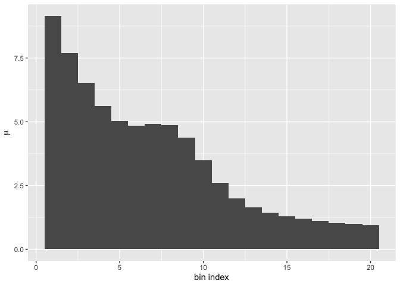

# A toy demonstration of the Profiled Feldman-Cousins Technique

This repository contains code to demonstrate the algorithms used in the
“Profiled Feldman-Cousins” technique for parameter and confidence
interval estimation. It is a *toy* demonstration in that the physical
model used is not motivated by any physics, and is very simple. The
actual problems to which this technique is applied are much more
complicated. The entire well-motivated and more more complex physical
models, and many more parameters.

## The toy physical model

Our toy physical model contains to major propositions:

1.  The process we are observing (the appearance of events with energy
    $x$ in our detector) is a Poisson process. This means the observed
    energy spectrum (the count of events in each energy bin) is an
    observation of a $N_b$ independent Poisson random variables, where
    $N_b$ is the number of bins in our spectrum.

2.  The Poisson mean $\mu_k$ for each bin $k$ (will will use $k$ to
    index energy bins) is:
    $$\mu_k = |A| e^{(-k/B)} + \left|\frac{C}{\Delta}\right| e^{-\frac{1}{2} (\frac{k-m}{\Delta})^2} + |D|$$

    $A$, $B$, $C$, $D$, $m$ and $\Delta$ each denote scalar values. We
    are interested in the parameters $m$ and $\Delta$; these are the
    parameters we are estimating. The parameters $A$, $B$, $C$ and $D$
    are nuisance parameters; they play a role in the “physics”, but we
    do not care about their values. Note the absolute values of $A$,
    $C/\Delta$ and $D$ are used; this is to enforce that fact that each
    term in the sum above must be non-negative. An alternative would be
    to use a constrained optimizer that would ensure each of $A$, $C$,
    $D$ and $\Delta$ is non-negative.

This means that the likelihood that we are maximizing is:
$${\cal L} = \prod\limits_{k=1}^{N_b} P(d_k | \mu_k)$$ where
$P(d_k | \mu_k)$ is the likelihood for observing $d_k$ events in a
Poisson process with mean $\mu_k$: $$P(d|\mu) = e^{-\mu} \mu^d / d!$$

In the real neutrino experiments, the formula for $\mu_k$ is much more
complicated, and the likelihood has additional multiplicative terms. But
the toy shared the essential feature that the likelihood for the
observed data depends upon the unknown values of the parameters, both
the interesting ones and the nuisance parameters.

Because individual likelihoods can be quite small, it is common to work
with the natural logarithm of the likelihood. The likelihood has a
maximum where the log of the likelihood has a maximum. Finally, we
usually work with the *negative* of the log of the likelihood. The
finding of the maximum likelihood corresponds to minimization of the
negative log likelihood.

Some physicists like working with the value defined as if we were
working with a Gaussian likelihood, in which case the log of the
likelihood would be the $\chi^2$ function. The typical definition of the
$\chi^2$ function contains a factor of two in the log. The definition of
$\lambda$ follows this tradition:

$$
\begin{aligned}
\lambda(A, B, C, D, m, \Delta) &= -2 \log({\cal L}) \\
                               &= 2 \sum\limits_{k=1}^{N_b} ( \mu_k - d_k \log(\mu_k) + \log(d_k!)  )
\end{aligned}
$$

Sometimes, Stirling’s approximation for $d_k!$ is introduced here, since
it is already quite accurate for $n=1$. The code in this repository does
*not* make this approximation.

Note that $\lambda$ above is a function of the parameters of the model
($A$, $B$, $C$, $D$, $m$, and $\Delta$); these are the variables being
fitted. It is not a function of the data $\vec{d}$, which are not
varied. Sometimes we will be using this equation to determine the
likelihood for the data actually observed by the experiment (or, in our
case, the simulation of the experiment). At other time we will be
calculating the likelihood of pseudoexperiment “data”. In either case,
the dependence of $\lambda$ on these parameters comes in through the
dependence of each $\mu_k$ on these parameters.

### Creating simulated data

Since we have not run a real physical experiment to collect data that we
can fit out our model, we need to generate some. This process is similar
(but not identical) to the process we’ll use for generating
pseudoexperiments. Note that this step is *not* part of the profiled FC
technique; it is something we have to do because we did not actually
perform an experiment to collect data.

First we need to specify the *true* values for the model parameters. In
the real world, we do not know the true values of the model parameters.
But because we are making a simulation, in our simulated world we get to
set the values. Note that this implies the proposition that our model is
a faithful model of physical reality. For the simulated reality, this is
true. In the real world, we do not know this is true. But in the
profiled FC analysis, we are not *testing* that proposition. We are
asserting the proposition, and then given that assertion, we are
estimating the values of the parameters of interest of the model.

| name  | value |
|:------|------:|
| A     |  10.2 |
| B     |   5.3 |
| C     |   3.5 |
| D     |   0.7 |
| m     |   8.3 |
| Delta |   1.8 |

Table 1: The true values for all the parameters in our model.

This set of parameters yields the following expected “shape” for the
spectrum. Note that this is a plot of the Poisson mean for each bin, not
the number of observed events in the simulated experiment (that we have
not yet simulated).

Finally, we generate $N_b$ Poisson random variates: the energy spectrum
of our simulated data. Our (simulated) spectrum is: 7, 4, 4, 3, 4, 6, 5,
3, 6, 5, 4, 1, 3, 0, 1, 1, 2, 0, 1, 0.

## Profiling over nuisance parameters

When we perform a physics experiment, we do not know the true values of
the model parameters we are estimating. We sometimes have information
about at least some of the parameters. Often this information takes the
form of estimated values and uncertainties for those parameters. In this
case, we will assume we have such information — from some other source,
not from our experiment — for all our nuisance parameters. We will
assume the following values and uncertainties when we are doing the
profiling over the nuisance parameters.

| name |  mean |   sd |
|:-----|------:|-----:|
| A    | 10.26 | 0.30 |
| B    |  5.16 | 0.10 |
| C    |  3.31 | 0.60 |
| D    |  0.76 | 0.04 |

## The Profiled Feldman-Cousins calculation

I am going to describe the features of the procedure as a task carried
out at a single point in the 2-dimensional space of $(m, \Delta)$. The
full procedure, as used to generate a single analysis plot, is to use
perform this task at as many places in the $(m, \Delta)$ plane as
necessary to generate smooth boundary contours for 1, 2, 3 and 4
$\sigma$ confidence regions.

Preliminary to starting the procedure at a given location $p$, defined
by the coordinate values $(m_p, \Delta_p)$, we first find the global
minimum value of $\lambda(A,B,C,D,m,\Delta | \vec{d})$, and the location
of this minimum value. We will call the minimum value $\lambda_B$ and
the parameter values at that location
$(A_B, B_B, C_B, D_B, m_B, \Delta_B$), where $B$ denotes “best fit”.

1.  Determine the minimimum value of $\lambda$ for the “real data”
    (i.e., our simulated spectrum) at the location $(m_p, \Delta_p$) by
    allowing the nuisance parameters $(A, B, C, D)$ to vary. We will
    call this minimum value $\lambda_p$. We do not care about the values
    of $(A, B, C, D)$ that are found for this fit, except that the
    values must be physically allowable. For example, none of $A$, $C$
    or $D$ can be negative. It is not yet clear how this is to be
    enforced.
2.  Generate $N_p$ (statistically independent) pseudoexperiments at the
    location $p$. Fit each pseudoxperiment the same way as was done to
    find $\lambda_p$, but using the generated spectrum of the
    pseudoexperiment rather than the “real data”. We index the
    pseudoexperiments with index $i$, and so denote each minimum value
    of $\lambda$ as $\lambda_i$.
3.  Determine the fraction of the $N_p$ pseudoexperiments that have this
    fitted $\lambda_i < \lambda_p$. This fraction is the probability we
    want for the location $p$.
